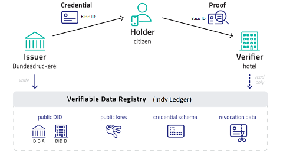
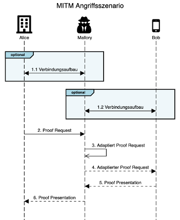
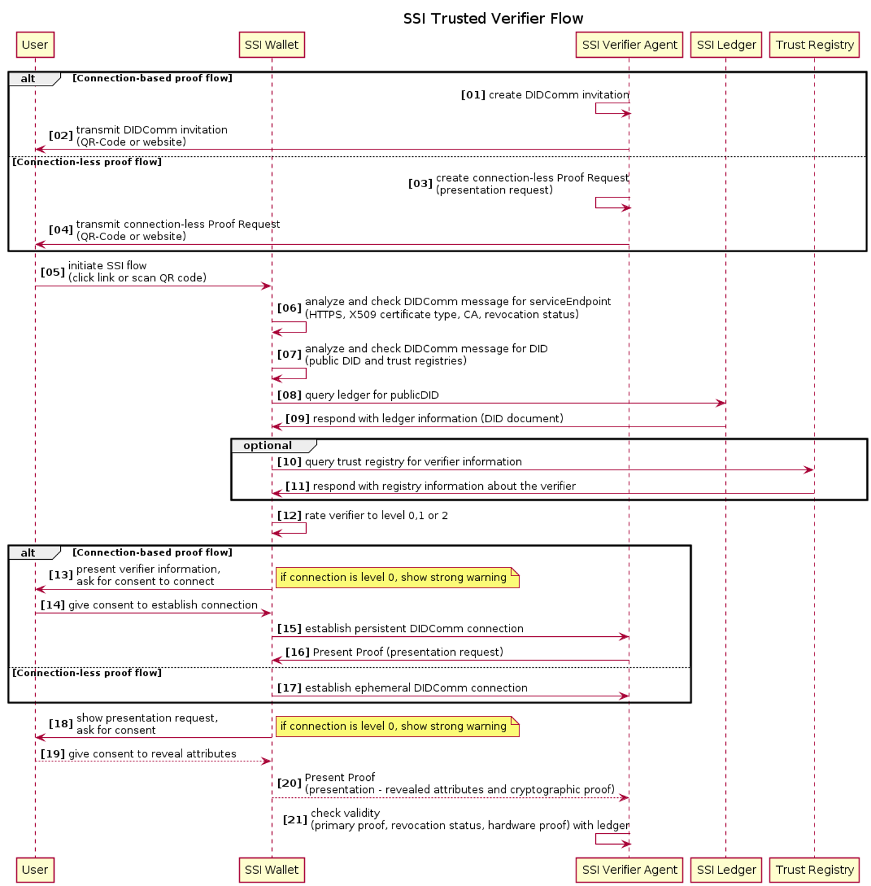
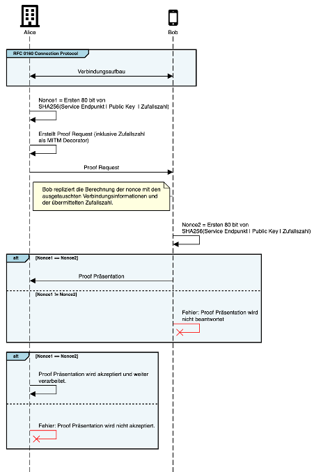
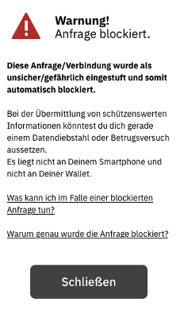
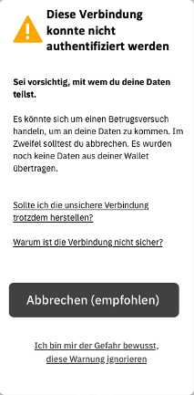
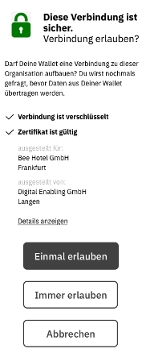
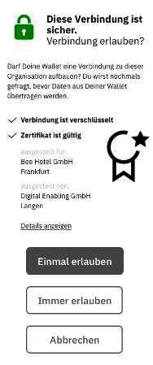

# Verifizierung von anfragenden Parteien (MITM Prävention & Detektion) <!-- omit in toc -->

*Dieses Dokument wurde in Zusammenarbeit von IBM Deutschland GmbH, esatus AG, Bundesdruckerei GmbH im Rahmen des Projektes "Ökosystem Digitaler Identitäten" erstellt.*

## Inhalt <!-- omit in toc -->
- [1. Zweck des Dokuments](#1-zweck-des-dokuments)
- [2. Systemübersicht](#2-systemübersicht)
  - [2.1. Verwendete Technologien und Protokolle](#21-verwendete-technologien-und-protokolle)
  - [2.2. Verbindungsaufbau](#22-verbindungsaufbau)
- [3. Problemstellung](#3-problemstellung)
  - [3.1. Angriffsszenarien](#31-angriffsszenarien)
  - [3.1.1. Szenario A: Phishing](#311-szenario-a-phishing)
  - [3.1.2. Szenario B: Man-In-The-Middle (MITM)](#312-szenario-b-man-in-the-middle-mitm)
  - [3.2. Szenario B: MITM Angriffsszenario Beschreibung](#32-szenario-b-mitm-angriffsszenario-beschreibung)
  - [3.3. Zusammenfassung](#33-zusammenfassung)
- [4. Anforderungen](#4-anforderungen)
  - [4.1. TR-03 107-01](#41-tr-03-107-01)
- [5. Lösungsbeschreibung](#5-lösungsbeschreibung)
  - [5.1. Motivation](#51-motivation)
  - [5.2. MITM Prävention](#52-mitm-prävention)
  - [5.2.1. Stufe 0: Nicht authentifiziert](#521-stufe-0-nicht-authentifiziert)
  - [5.2.2. Stufe 1: Authentifiziert](#522-stufe-1-authentifiziert)
  - [5.2.3. Stufe 2: Vertrauenswürdig](#523-stufe-2-vertrauenswürdig)
  - [5.3. MITM Detektion](#53-mitm-detektion)
  - [5.4. UI/UX Darstellung](#54-uiux-darstellung)
- [6. Offene Punkte](#6-offene-punkte)
- [7. Appendix](#7-appendix)
  - [7.1. Ephemeral Proof Request Beispiel](#71-ephemeral-proof-request-beispiel)
  - [7.2. Request_presentation~attach.data.base64](#72-request_presentationattachdatabase64)
  - [7.3. Proof Presentation Beispiel](#73-proof-presentation-beispiel)
  - [7.4. Connection-Based Proof Request Beispiel](#74-connection-based-proof-request-beispiel)
  - [7.5. Request_presentation~attach.data.base64](#75-request_presentationattachdatabase64)
- [8. Referenzen](#8-referenzen)

##  1. Zweck des Dokuments

Dieses Konzept beschreibt Maßnahmen, um ein Vertrauensverhältnis zwischen Nutzern und Verifier herzustellen. Dazu wird ein mögliches Angriffsszenario beschrieben, in welchem ein Angreifer versucht das bestehende Verfahren auszunutzen, um an Nutzerdaten zu gelangen. Der beschriebene Angriff macht sich dabei den Umstand zunutze, dass es sich um ein offenes Netzwerk handelt und jede Partei eine Verifikationsanfrage stellen darf. Ein Angreifer könnte dabei einen Nutzer dahingehend täuschen eine vertrauenswürdige Partei zu sein. Sollte der Nutzer auf diese Phishing-Attacke hereinfallen, könnte der Angreifer dieses zu Unrecht erworbene Vertrauensverhältnis mit einer Man-In-The-Middle (MITM) Attacke kombinieren und sich abgeleitete Credentials ausstellen lassen. In Kapitel 3 wird die Problemstellung und die Angriffsszenarien technisch ausführlich beschrieben. Kapitel 4 beschreibt die Anforderungssituation an das System. In Kapitel 5 wird die Lösung vorgestellt, die aus den zwei Bereichen besteht:

1.	MITM Prävention: Verhinderung einer Phishing Attacke und einer damit verbundenen möglichen MITM Attacke.
2.	MITM Detektion: Erkennung einer MITM Attacke, im Falle, dass die Präventions Maßnahmen umgangen werden konnten. 

Zum besseren Verständnis des Lesenden werden die gängigen Bezeichnungen Alice (Verifier) und Bob (Nutzer) sowie Mallory (Angreifer) verwendet.

**Abgrenzungen**

* IT-Systemkonzept: Dieses Dokument stellt eine Ergänzung zu den Konzepten beschrieben in den Systemkonzepten zum Hotel Checkin und SSI-basierter Führerscheinnachweis dar und spezifiziert die technischen und organisatorischen Details im Kontext „Trusted Verifier“ aus.
* Smart eID: Es wird angenommen, dass die Smart eID in die ID Wallet integriert, wird un die Identifizierung des Verifiers für die Smart eID gemäß der Smart eID Lösung erfolgt. Für die Nutzung von Identitäts-/hoheitlichen Nachweisen, die kein entsprechend hohes Vertrauensniveau erfordern und somit mit der Basis-ID bedient werden können, sowie für weitere nicht-hoheitliche Nachweise des Ökosystems, sollen die in diesem Konzept beschriebenen Verfahren zur Anwendung kommen.
* Bedrohungsanalyse: Dieses Dokument stellt keine komplette Bedrohungsanalyse dar, sondern lediglich eine Analyse eines potenziellen Angriffs auf das Authentifizierungsverfahren der Verifizierung. Es ist daher eine Ergänzung zu dem Dokument Bedrohungsanalyse für das Projekt 2080069021.


##  2. Systemübersicht



Der **Issuer** (Bundesdruckerei) stellt ein signiertes, gerätegebundenes Credential (Basis-ID, Digitaler Führerschein) auf Grundlage der eID Attribute des Personalausweises aus.

Der **Holder** (Nutzer) erhält nach Durchführung der Online-Ausweisfunktion die Basis-ID in seiner ID-Wallet App. Dies ermöglicht eine spätere Nutzung der Basis-ID mit dem beim Ausstellungsprozess verwendeten mobilen Endgerät.

Der **Verifier** (z.B. Hotel) prüft die vom Nutzer vorgezeigten Credentials (Basis-ID und z.B. Arbeitgeberbescheinigung) während eines Authentifizierungsvorgangs. Dabei kann er die Authentizität der Daten mit Hilfe der Prüfinfrastruktur und die Gerätebindung mit Hilfe der ID-Wallet App verifizieren.

Das **Verifiable Data Registry** ist ein öffentliches, genehmigungspflichtiges Blockchain-Netzwerk (Hyperledger Indy) zur Speicherung von öffentlichem Schlüsselmaterial und dezentrale Prüfinfrastruktur, betrieben von authentisierten und autorisierten Knotenbetreibern. Eine Blockchain kommt daher zum Einsatz, um die Verfügbarkeit der öffentlichen Schlüsselmaterialien als auch Schema und Revozierungsdaten zu erhöhen. Zusätzlich eliminiert die Blockchain die Notwendigkeit einer zentralen Organisation, welche das öffentliche Schlüsselmaterial, Schema und Revorzierungsdaten verwaltet.

###  2.1. Verwendete Technologien und Protokolle

Die folgende Liste gibt einen Überblick über die verwendeten Technologien und Protokolle implementiert von dem Aries Agenten ACA-Py.

* AnonCreds 1.0: JSON-LD oder JWT werden nicht verwendet.
* CL (Camenisch-Lysyanskaya) Signaturen
* Connection-less Proof Requests (“Ephemeral Proof Requests”)
    * RFC 0037: https://github.com/hyperledger/aries-rfcs/blob/main/features/0037-present-proof/README.md
    * RFC 0434 (URL-Shortening) https://github.com/hyperledger/aries-rfcs/blob/main/features/0434-outofband/README.md#url-shortening
    * RFC 0056 Service Decorator: https://github.com/hyperledger/aries-rfcs/tree/main/features/0056-service-decorator
* Connection-based Proof Requests
    * RFC 0037: https://github.com/hyperledger/aries-rfcs/blob/main/features/0037-present-proof/README.md
    * RFC 0160: https://github.com/hyperledger/aries-rfcs/blob/main/features/0160-connection-protocol/README.md
* DIDComm v1.0: Ist ein Transport agnostisches Protokoll, welches auf der Nachrichten Ebene aufbaut und mit unterschiedlichen Transport Ebenen kombiniert werden kann. Z.B. HTTPS + DIDComm, Web Socket + DIDComm, Bluetooth + DIDComm. Ziel von DIDComm ist es einen sicheren Kanal zu etablieren welcher unabhängig von der Transport Ebene funktioniert.

###  2.2. Verbindungsaufbau

Um eine Präsentation zu einem Proof Request vorlegen zu können muss der Holder  den Endpunkt des Verifiers kennen. Die in den Aries RFCs beschriebenen Protokolle erlauben das in den folgenden beiden Ausbaustufen. Dabei nutzen beide Protokolle TLS als Basis für die Verschlüsselung der HTTP Kommunikation.

Connection-less („ephemeral“) Proof Requests: Der Verifier fügt in seinem Proof Request entsprechende „Service Decorators“ hinzu, welche unverschlüsselt beschreiben, wo eine Präsentation hingeschickt werden soll. Es wird eine ephemeral DIDComm-Verbindung aufgebaut, die nach dem Prozess verworfen wird.

Connection-Based Proof Requests: Der Verifier und der Holder erstellen initial eine persistente, wiederherstellbare Ende-zu-Ende verschlüsselte Verbindung, für die Schlüsselpaare und Endpunkte ausgetauscht werden. Der initiale Aufbau der DIDComm Verbindung (DIDComm-Invitation) erfolgt unverschlüsselt. Sämtliche fortführende Kommunikation basiert dann auf der etablierten Verbindung.

In beiden Szenarien müssen die folgenden Daten ausgetauscht werden.

* Recipient Keys: Der öffentliche Schlüssel des Agenten des anfragenden Verifizieres.
* Service Endpoint: Der öffentliche Endpunkt des Agenten, an welchen die Proof Präsentation geschickt werden soll.
* Routing Keys (optional): Optional können hier weitere öffentliche Schlüssel hinterlegt werden, mit denen die verschlüsselte Nachricht nochmals für eventuelle Routingpartner, wie zum Beispiel Mediatoren, verschlüsselt wird.

Um diese Informationen auszutauschen, werden diese enkodiert und vom Verifier dem Holder mitgeteilt. Dies kann beispielsweise in Form einer gekürzten URL in einem QR-Code physisch abgedruckt sein oder auf einer Webseite dynamisch generiert und mittels   Webseite abgefragt werden. Auch andere Methoden zur Übermittlung sind möglich, z.B. mittels URL Deep Link.

Diese Daten können explizit oder implizit in den folgenden Varianten ausgetauscht werden.

**Explizit**

Die Daten sind direkt in der DIDComm-Invitation oder im Proof Request enthalten, wie im folgenden Beispiel dargestellt:

```json
{
    "recipientKeys": ["8HH5gYEeNc3z7PYXmd54d4x6qAfCNrqQqEB3nS7Zfu7K"],
    "serviceEndpoint": "https://example.com/endpoint"
}
```

**Implizit**

Die DIDComm-Invitation oder der Proof Request beinhaltet die Referenz auf eine DID. Diese DID kann mit Hilfe eines DID Resolvers zu einem DID-Document aufgelöst werden, welches die notwendigen Informationen zu Recipient Keys und Service Endpoint enthält. 

```json
{
    "did": "did:sov:QmWbsNYhMrjHiqZDTUTEJs"
}
```

Inhalt im DID-Document:
```json
{
    // [...]
    "recipientKeys": ["8HH5gYEeNc3z7PYXmd54d4x6qAfCNrqQqEB3nS7Zfu7K"],
    "serviceEndpoint": "https://example.com/endpoint"
    // [...]
}
```

##  3. Problemstellung

Die Anwendung bringt verschiedene Parteien (Holder, Verifier und Issuer) in einem dezentralen Ökosystem nach Self-Sovereign-Identity-Prinzip zusammen. In diesem System ist jeder Teilnehmer berechtigt, als Verifier aufzutreten. Das bedeutet, dass jeder Teilnehmer eine Verifikationsanfrage an jeden Holder erstellen kann. Es liegt in der Verantwortung des jeweiligen Nutzers (Holder), die Anfrage und die Vertrauenswürdigkeit des Verifiers zu prüfen. Daraus ergibt sich das Risiko, dass ein Holder seine Credentials (oder Infomationen über Credentials) mit einem unberechtigten Verifier teilt.

###  3.1. Angriffsszenarien

In den folgenden Kapiteln betrachten wir zuerst das Bedrohungsszenario Phishing und in weiterer Folge das Szenario Man in the Middle. Beide Betrachtungen konzentrieren sich dabei ausschließlich auf das Verifikationsverfahren.

###  3.1.1. Szenario A: Phishing
Bei einem Phishing-Angriff versucht sich der Angreifer gegenüber einem Holder als vertrauenswürdiger Kommunikationspartner auszugeben. Die Kommunikation kann bei der SSI-Technologie hierbei sowohl über einen physischen als auch über einen virtuellen Kanal initiiert werden. Der Angreifer könnte bereits vorhandene (für SSI-Technologie verwendete) QR-Codes austauschen oder neue QR-Codes beispielsweise auf Werbeplakaten aufkleben. Alternativ könnten klassische Phishing-Szenarios über Mail, SMS, IM-Nachrichten, (gekaperten) Phishing-Webseiten oder ähnliches vom Angreifer verwendet werden, um QR-Codes oder Deep-Links zum Aufbau eines Kommunikationskanals zu verschicken. Nach dem Aufbau des Kommunikationskanals mittels DIDComm sendet der Angreifer einen Proof Request. Der Angreifer kann in diesem Szenario geprüfte und verifizierte Daten des Holders unberechtigter Weise erlangen. Die erbeuteten Rohdaten können für eine technisch separate oder physische Interaktion weiterbenutzt werden, der kryptografische Proof an sich kann jedoch vom Angreifer selbst nicht gegenüber einem Dritten weiterverwendet werden.

###  3.1.2. Szenario B: Man-In-The-Middle (MITM)
Beim MITM-Angriff steht der Angreifer physisch oder logisch zwischen den Kommunikationspartnern Holder und Verifier und täuscht diesen vor, der jeweils andere zu sein. Damit dieser Angriff funktioniert, muss der Angreifer seine Kommunikationspartner beim Verbindungsaufbau zunächst von einer gegenseitigen Vertrauenswürdigkeit überzeugen bzw. täuschen. Das bedeutet, dass ein erfolgreiches Phishing-Szenario die Voraussetzung und Grundlage für den MITM-Angriff ist. Aufbauend darauf, leitet ein Angreifer die Kommunikation vom Holder über sich an den eigentlichen Verifier weiter. Anders als beim reinen Phishing werden die Daten weitergeleitet und die Funktionalität nicht beeinträchtigt. Der Angreifer kann sich in diesem Szenario gegenüber dem echten Holder als Verifier aus und gegenüber dem echten Verifier als Holder ausgeben. Auch dieser Angriff funktioniert sowohl in einem physischen und einem elektronischen Szenario. Beispielsweise könnte ein Angreifer beim Hotel Checkin nach Systemkonzept 2080069021 den echten QR-Code des Hotels einscannen, die Verbindung zum Hotel aufbauen und eine gefälschte Einladung an den legitimen Hotelgast schicken in der Hoffnung, dass der echte Holder seine BasisID vorzeigt. Bei einem erfolgreichen MITM-Angriff könnte der Angreifer nun an Stelle des legitimen Gasts im Hotel einchecken. In einem anderen Beispiel könnte der Angreifer in einem Online-Portal für eine Zutrittskontrolle einen Gästeausweis beantragen, den vom echten Verifier angefragten Proof Request an den echten Holder weiterleiten und den Nachweis der BasisID an die Zutrittskontrolle zurückspielen. Nach erfolgreicher Prüfung der BasisID, welche als Identifizierung des echten Holders gilt, stellt die Zutrittskontrolle nun ein Gästeausweis-Credential aus, welches der MITM-Angreifer nun in seine eigene Wallet lädt. Der Angreifer konnte in diesem Fall ein abgeleitetes Credential abfangen.


###  3.2. Szenario B: MITM Angriffsszenario Beschreibung



1. Optional wird zu Beginn der Interaktion eine Verbindung zwischen den Parteien hergestellt. Für den Ablauf der Attacke ist dieser Schritt jedoch nicht zwingend notwendig, sofern Alice Verbindungsinformationen im Proof Request hinzufügt (siehe Kapitel 2.2 Verbindungsaufbau). Im Schritt des Verbindungsaufbaus muss Mallory zudem jeweils Alice und Bob von seiner Vertrauenswürdigkeit überzeugen. Im Beispielfall des Hotel-Checkins würde Mallory zunächst den QR-Code mit den Verbindungsinformationen des Hotels (Alice) einlesen, um eine Verbindung herzustellen. Nun würde er Bob eine gefälschte Einladung schicken (Phishing-Attacke, siehe 3.1.1), welcher dieser fälschlicherweise annimmt. Dadurch stellt Mallory nun für Alice den scheinbar legitimen Holder und für Bob den scheinbar legitimen Verifier dar.
1. Alice übermittelt einen Proof Request an Mallory (da sie davon ausgeht, dass Mallory in diesem Szenario der legitime Holder ist).
1. Mallory adaptiert den Proof Request, um sich vor Bob als die korrekte Partei (Verifier) auszugeben.
1. Mallory übermittelt den adaptierten Proof Request an Bob. Im Beispiel des Hotel-Checkins würde dieser eine Anfrage an die Basis ID enthalten.
1. Bob beantwortet den Proof Request und schickt die Präsentation an Mallory – siehe Appendix 7.2
1. Mallory leitet die Proof Präsentation an den Agenten von Alice weiter.

Dieses Szenario ist unabhängig vom initialen Kommunikationsaufbau (connection-less oder connection-based), da Mallory sich in beiden Fällen als „Man-in-the-Middle“ etablieren könnte und potentiell abhängig vom fortlaufenden Prozess entweder unbemerkt Verifikationsvorgänge mitlesen oder sogar Identitäten übernehmen könnte.

###  3.3. Zusammenfassung

* Als Grundlage für Szenario B, muss Mallory zunächst Bob mittels einer Phishing Attacke davon überzeugt haben, vertrauenswürdig zu sein, um legitim eine Verbindung aufbauen zu können (siehe Kapitel 3.1.1).
* Alice ist nicht in der Lage, zu erkennen, dass Mallory sich als Bob ausgibt.
* Mallory könnte nach Schritt 6 den Prozess übernehmen. z.B: ein Credential wird ausgestellt nach erfolgreicher Basis-ID Verifikation. Dadurch entsteht auch das Risiko einer Identitätsübernahme, wenn auf Grundlage der weitergeleiteten Basis-ID weitere Identitätscredentials ausgestellt werden (siehe Beispiel in Kapitel 3.1.2). Im Fall des Hotel-Checkins kann Mallory so fälschlicherweise als Bob einchecken, ohne dass Alice diesen Umstand bemerken würde.
* Mallory kann die Präsentation nicht ändern oder weiterverwenden (Replay ist ausgeschlossen). Es wird ein Proof über den Besitz eines Credentials geschickt, aber nicht das Credential selbst. Das schließt jedoch nicht aus, dass man mittels der Präsentation einer Basis-ID nicht weiterführende Credentials erhalten könnte.

##  4. Anforderungen

Beide in Kapitel 2 beschriebenen Angriffsszenarien müssen für den Holder und Verifier bestmöglichst abgesichert werden. Zusätzlich müssen die Vorgaben der TR-03107-01 für ein angestrebtes Sicherheitsniveau“substanziell”, wie folgt beschrieben, berücksichtigt werden. 

###  4.1. TR-03 107-01

Die folgende Liste beschreibt einen Auszug der TR-03107-01 mit Relevanz für das hier beschriebene Konzept.

* G23: Eine vorhergehende Identifizierung des Dienstes (und damit verbunden der Aufbau einer sicheren Verbindung) ist Voraussetzung für die nachfolgenden Kriterien und muss daher mindestens mit dem angestrebten Vertrauensniveau der Identifizierung einer Person erfolgen; die Vertraulichkeit der Identitätsattribute einer Person setzt eine Identifizierung des empfangenden Dienstanbieters auf gleichem Vertrauensniveau wie die Identifizierung der Person voraus. Die einzige Möglichkeit, den Dienst zu identifizieren, besteht in der Verifikation der URL und des TLS-Zertifikats des Dienstes. Hierbei muss der Prüfer evaluieren, dass die Anforderungen aus den Abschnitten 3.12 und 3.20 für den Dienst erfüllt sind. Zusätzliche Auswertungshinweise für substantiell: Der Prüfer muss sich die verwendeten TLS-Zertifikate anschauen. Diese eignen sich, um das Prüfobjekt zweifelsfrei zu identifizieren.

* G2: Es muss sichergestellt werden, dass Authentisierungsmittel nur an den berechtigten Inhaber ausgegeben werden.

* G6: Das Authentisierungsprotokoll muss gegen Angreifer mit Angriffspotential gemäß Abschnitt 3.1 sicher sein.

* G24: Die Authentisierungsmittel müssen so gestaltet werden, dass der berechtigte Inhaber sie gegen Missbrauch durch Dritte mit Angriffspotential gemäß Abschnitt 3.1 schützen kann.

##  5. Lösungsbeschreibung

Das folgende Kapitel beschreibt den Lösungsansatz, um die Angriffsvektoren auf unterschiedlichen Ebenen zu mitigieren.

###  5.1. Motivation

Da das Angriffspotential immer mit einer erfolgreichen Phishing Attacke einhergeht, muss in erster Linie der Nutzer in die Lage versetzt werden, besser zu erkennen, mit wem er seine Daten teilt. Dabei steht weiterhin im Vordergrund, im Sinne des SSI-Gedankens den Nutzer emanzipiert über seine Daten entscheiden zu lassen.

Die folgenden Darstellungen fokussieren sich daher auf diese Fragestellungen:

1. MITM Prävention: Wie kann das Vertrauen in den Endpunkt erhöht werden?
1. MITM Detektion: Wie kann eine potenzielle MITM Attacke erkannt werden?
1. UI/UX Darstellung: Wie wird der Nutzer über das Risiko einer Anfrage informiert?

###  5.2. MITM Prävention

Die Basis der Prävention von MITM-Attacken basiert auf Authentifizierung. Die MITM-Prävention sieht Authentifizierung auf zwei Ebenen vor:
* Absicherung mittels Service Endpoint URL (TLS)
* Absicherung mittels public DID (DIDComm)
In den bestehenden Szenarien wird eine HTTPS-Verbindung zu einer Service Endpunkt URL aufgebaut und in diesem Transportkanal eine abermals verschlüsselte DIDComm-Verbindung auf Nachrichtenebene etabliert. Möglich sind hier also die Verwendung von Authentifizierungsmöglichkeiten des bestehenden HTTPS Systems mittels X.509-Zertifikaten und den dahinterstehenden PKIs und die Authentifizierung von public DIDs auf dem Indy-Ledger bzw in einer Trust Registry. Darüber hinaus gibt es verschiedene technische Möglichkeiten, wie zum Beispiel die Well-Known DID Konfiguration , um eine Verknüpfung der Domain des Service Endpoints mit der public DID des Verifiers herzustellen. Mit Hilfe dieser Mechanismen muss die Wallet die Authentizität des Verifiers prüfen und dem Nutzer diese Informationen als Hilfsmittel für die Entscheidung mitgeben. Dazu hilft eine Einordnung der Authentizität in zwei oder mehrere Stufen:
* Stufe 0: Nicht authentifiziert
* Stufe 1: Authentifiziert
* Stufe 2: Vertrauenswürdig
Die Wallet analysiert die oben genannten Authentifizierungsmerkmale und macht eine Einordnung zur höchsten erreichten Stufe. Darüber hinaus muss die Wallet die Anfrage ablehnen, wenn die Bedingungen der Stufe 0 nicht erreicht werden.

###  5.2.1. Stufe 0: Nicht authentifiziert
* Bedingungen:
    * HTTPS mittels self-signed, expired Zertifikaten oder valide DV/OV-Zertifikate (zum Beispiel “lets encrypt”)
* Anzeige (siehe Kapitel 5.4):
    * Anzeigen einer Warnung für unsichere Verbindungen / Anfragen (Phishing-Gefahr)
    * Anzeige des Service Endpunkt URLs (URL des Agenten des Verifier)
    * Keinen selbst-attestierten Attributen vertrauen (z.B. Label im Verbindungsaufbau, siehe RFC 0160)

###  5.2.2. Stufe 1: Authentifiziert
* Bedingungen:
    * HTTPS mittels EV  oder QWAC  Zertifikat
    * Überprüfung der Gültigkeit Public DIDs des EESDI Ledgers (mit einem Eintrag auf dem Ledger geht ein Registrierungsprozess und Vertragsabschluss gegenüber der Betreiber-Organisation einher)
    * DIDs werden mit den Service Endpunkt mittels well-known DID Konfiguration verlinkt, did:web, did:dns, etc.
* Anzeige (siehe Kapitel 5.4):
    * Anzeige des Unternehmensnamens des EV oder QWAC Zertifikats
    * Verlinkung zu mehr Informationen zum Unternehmen, zum Beispiel der DID

###  5.2.3. Stufe 2: Vertrauenswürdig
* Bedingungen:
    * PublicDID-Eintrag in einem Vertrauensregister
* Anzeige (siehe Kapitel 5.4):
    * Grafische, vertrauensstärkende Unterstützung, ähnlich “Twitter-Haken"

Eine Trust Registry ist ein anwendungsfallspezifisches Vertrauensregister mit einer Auflistung authentifizierter Entitäten. Dieses kann zum Beispiel durch einen Trust Service Provider, die Betreiber-Organisation, einen vertrauenswürdigen IT-Dienstleister wie die Bundesdruckerei oder einen existierenden Dachverband betrieben werden. Es obliegt der Wallet, spezielle, anwendungsspezifische Trust Register einzubinden, für eine bürgerorientierte Wallet bietet sich ein Register mit vertrauenswürdigen, hoheitlichen Stellen an.

Für den „Relaunch“ der Wallet streben wir an, die Ausbaustufe 0 sowie die Stufe 1 ohne Public DIDs zu unterstützen. Siehe Kapitel 5.4 für Details der Darstellung in der ID Wallet.



Das Sequenzdiagramm beschreibt zunächst den regulären Prozess zur Initiierung eines Verifizierungsvorgangs, wobei der SSI Agent des Verifiers eine Anfrage generiert an den Nutzer überträgt und dieser seine Wallet öffnet `[01-05]`. Die Wallet analysiert nun die einkommende Verbindung, insbesondere die HTTPS-Verbindung und die zugehörigen X509-Zertifikate `[06]` und gleicht die anfragende DID mit dem Ledger `[07-09]` und einer oder mehreren, optionalen Trust Registry ab `[10-11]`. Basierend auf diesen Ergebnissen bewertet die Wallet die Vertrauenswürdigkeit und Authentizität des Verifiers mit einem Level 0, 1 oder 2 (bei einer Bewertung unter Level 0 wird die Anfrage abgelehnt) `[12]`. Diese Information wird in der Wallet nun dem Holder bestmöglich vermittelt und dargestellt `[18-19]`. Basierend auf der Entscheidung des Nutzers wird die Wallet nun die Anfrage ablehnen oder annehmen und den regulären Prozessfluss zur Beantwortung des Proof Requests weiterverfolgen `[20-21]`.

###  5.3. MITM Detektion

Obwohl die im vorigen Kapitel beschriebene MITM Prävention bereits eine signifikante Hürde für einen Angreifer darstellt, bleibt die Entscheidung beim Holder einen Proof Request zu beantworten. Daher beschreibt dieses Kapitel, wie eine MITM Attacke mit technischer Hilfe erkannt werden könnte.

Die Erstellung eines Proof Requests beinhaltet eine „Nonce“ (number once used), welche vom Verifier zufällig bestimmt wird. Im Rahmen der MITM-Detektion würde diese Nonce mit einem Wert versehen werden, welcher über die Kommunikation hinweg vom Verifier und Holder verifiziert werden kann. Dabei macht sich der beschrieben Algorithmus den Umstand zu Nutze, dass die Nonce Teil der Proof Präsentation und diese nur bei Kenntnis des Link secrets erstellt werden kann. Spätestens der Verifier kann daher prüfen ob die Präsentation für sie gedacht war oder nicht.

**Proof Request**



1. Optional tauschen Bob und Alice initial ihre Verbindungsinformationen aus. Für den folgenden Ablauf ist dieser Schritt jedoch nicht zwingend notwendig, wenn Alice ihre Verbindungsinformationen direkt in den Proof Request hinzufügt („ephemeral Proof Request“)
2. Alice generiert für den Proof Request eine 128bit Zufallszahl
3. Alice berechnet die Nonce1 aus ihren Verbindungsinformationen inklusive einer Zufallszahl. (siehe Sektion Nonce Erstellung für mehr Details)
4. Alice erstellt einen Proof Request entsprechend der RFC 0037 und fügt die erstellte Zufallszahl als MITM Decorator (siehe RFC 0011) zum Proof Request hinzu.
5. Alice übermittelt den Proof Request an Bob.
6. Bob repliziert die Berechnung der Nonce2 aus dem ihm bekannten Verbindungsinformationen und der übermittelten Zufallszahl im MITM Decorator. Die Verbindungsinformationen wurden zuvor in einem separaten Protokoll ausgetauscht oder dem Proof Request mittels Service Decorator (siehe RFC 0056) hinzugefügt.
7. Wenn Nonce1 der Nonce2 entspricht kann sich Bob sicher sein, dass der Proof Request nicht manipuliert wurde und den Proof Request beantworten Dabei benutzt er die 80bit nonce als Eingangsparameter für das AnonCreds-Protocol (CL-Signatur).
    1. Wenn Nonce1 der Nonce2 nicht entspricht wurde der Proof Request manipuliert. Bob beantwortet den Proof Request nicht.
8. Alice prüft die Proof Präsentation von Bob ob die original ausgeschickte Nonce1 der Nonce2 (inkludiert in der Proof Präsentation) entspricht.
    1. Wenn Nonce1 der Nonce2 entspricht, kann sich Alice sicher sein, dass die Proof Präsentation für sie gedacht war und den Prozess fortführen. Hierbei benutzt sie die 80bit nonce als Eingangsparameter für das AnonCreds-Protocol (CL-Signatur).
    2. Wenn Nonce1 der Nonce2 nicht entspricht wurde die Proof Präsentation weitergeleitet (MITM). Alice bricht die Verarbeitung ab.

**Zusammenfassung**

* Bob könnte immer noch Opfer einer Phishing Attacke werden, jedoch kann Mallory die Präsentation nicht an Alice weiterleiten. Das wird dadurch ausgeschlossen, dass enkodierten Verbindungsinformationen in der Nonce mit den ausgetauschten Verbindungsinformationen übereinstimmen müssen. 
    * Würde Mallory die Verbindungsinformationen anpassen (ohne die Nonce anzupassen), würde Bob über die Nonce erkennen, dass die Verbindungsinformationen nicht übereinstimmen. Die Proof Request Anfrage würde daher nicht beantwortet werden.
    * Würde Mallory versuchen, auch die Nonce anzupassen, damit er die Verbindungsinformationen von Mallory enthält, erkennt Alice (sobald die Proof Präsentation weitergeleitet wurde), dass die Präsentation nicht für sie gedacht war.

**Nonce Erstellung**

Der Verifier enkodiert folgenden Daten in die Nonce
* öffentlicher Schlüssel der DID des Verifiers
* Service Endpunkt des Agenten
* Eine 128bit Zufallszahl

Mittels SHA256 werden diese Informationen auf 256 bits komprimiert, da die Nonce jedoch lediglich 80 bit lang sein darf, werden nur die ersten 80 bits des digests als nonce verwendet.

Die Zufallszahl wird zusätzlich im Proof Request als spezifischer „MITM Decorator“ (Attribute in der Json struktur) mitgeschickt. Bob kann daher den hash Vorgang replizieren und prüfen ob die geschickten Verbindungsinformationen (öffentlicher Schlüssel und Service Endpunkt) verändert wurde, bzw. sicherstellen, dass seine Präsentation ausschließlich vom Empfänger verwendet werden kann.

```json
{ 
  "@type": "https://didcomm.org/present-proof/1.0/request-presentation", 
  "~mitm-detection": { 
     "nonce": " da492bc95dc1d951f0b29a74c205408e " // the original hex encoded nonce 
  }
  // [...]
}
```

###  5.4. UI/UX Darstellung

Wie in Kapitel 5.2 aufgeführt, wird für den Relaunch die Implementierung Authentizitäts-Stufe 0 und 1  angestrebt. Dafür werden die dort festgelegten Kriterien bei der Herstellung einer neuen Connection überprüft.

Hinweis: Die folgenden Darstellungen sind Konzeptskizzen und stellen kein abschließendes Design dar. Aufbau und Inhalt werden sich entsprechend im Verlauf noch ändern.

| Blockiert | Stufe 0 | Stufe 1 | Stufe 2
| ----------- | ----------- | ----------- | ----------- |
|  |  |  |  |

**Überprüfung auf Stufe 0**

Zunächst wird für Stufe 0 das Bestehen einer sicheren Verbindung per HTTPS verifiziert. Sollte diese Prüfung fehlschlagen, wird der untenstehende Warnhinweis angezeigt. Da das Bestehen der Stufe 0 eine Grundvoraussetzung für einen konformen Ablauf der weiteren Schritte darstellt, soll hier keine direkte Möglichkeit zum Umgehen der Sicherheitsmeldung gegeben werden. Für Entwickler o.ä. soll hingegen in den Einstellungen eine Option zu finden sein, um ihnen beispielsweise die Entwicklung in einer lokalen Testumgebung zu erleichtern.


**Überprüfung auf Stufe 1**

Mit Stufe 1 wird das Vorhandensein eines EV- oder QWAC-Zertifikats überprüft. Sollte die anfragende Stelle kein derartiges Zertifikat vorweisen können, wird der Nutzer mit einer Warnung darauf hingewiesen. Der dafür genutzte Screen ist ähnlich zum Vorgehen im Browser, falls ein ungültiges HTTPS-Zertifikat vorgelegt wird bzw. nur eine HTTP-Verbindung besteht: Der Nutzer wird über die potenzielle Gefahr ausreichend informiert, kann jedoch nach eigenem Ermessen diese Connection trotzdem herstellen.

Sollte die Überprüfung andererseits erfolgreich durchlaufen werden, kann der User diese Connection-Anfrage ohne Einschränkungen immer oder nur einmal akzeptieren bzw. ablehnen.

 
##  6. Offene Punkte

* MITM-Attacke formalisieren (Decorator ...) und an Community als RFC o.ä. zurückspiegeln
* Aktuell arbeiten wir mit dem AIP 1.0 Profile, Erweiterungen auf AIP 2.0 müssen entsprechend evaluiert werden. Sofern die ID-Wallet diese Funktionalitäten bereits unterstützt, muss geprüft werden, wie die „nicht standard“ Wege potentiell ausgenutzt werden können.

##  7. Appendix

###  7.1. Ephemeral Proof Request Beispiel

```json
{
    "@type": "https://didcomm.org/present-proof/1.0/request-presentation",
    "~service": {
        "recipientKeys": ["8HH5gYEeNc3z7PYXmd54d4x6qAfCNrqQqEB3nS7Zfu7K"], // the public key of the receiving cloud agent.
        "routingKeys": [],
        "serviceEndpoint": "https://agent.Alice.de/" // the public endpoint of the cloud agent.
    },
    "~thread": {
        "thid": "98fd8d72-80f6-4419-abc2-c65ea39d0f38" // a correlation id used to link verification flow steps.
    },
    "request_presentations~attach": { 
       "@id":"libindy-request-presentation-0",
       "mime-type":"application/json",
        "data": {
         "base64":"eyJuYW1lIjogIlByb29mIHJlcXV...=="
        }
    }
}
```

###  7.2. Request_presentation~attach.data.base64

Das folgende “Snippet” zeigt den base64 dekodierten Teil des in 6.1 gezeigten “Ephemeral Proof Requests“ Attributes „request_presentation~attach.data.base64“ 

```json
{
    "name":"Proof request",
    "nonce":"-396525763946594657431706",
    "requested_attributes":{
       "checkin":{
          "names":[
             "familyName",
             "firstName",
             "dateOfBirth",
             "addressStreet",
             "addressZipCode",
             "addressCity",
             "addressCountry"
          ],
          "non_revoked":{
             "to":1635165080
          },
          "restrictions":[
             {
                "cred_def_id":"MGfd8JjWRoiXMm2YGL4SGj:3:CL:43:Basis-ID Testnetzwerk"
             }
          ]
       }
    },
    "requested_predicates":{
       
    },
    "version":"0.1"
 }
 ```


###  7.3. Proof Presentation Beispiel
```json
{
    "thread_id": "b0431d7a-a8c2-4cf7-b348-e4378b1539ea",
    "created_at": "2021-10-25 12:39:39.902735Z",
    "updated_at": "2021-10-25 12:39:57.591651Z",
    "connection_id": null,
    "initiator": "self",
    "presentation_proposal_dict": null,
    "presentation_request": {
        "name": "Proof request",
        "nonce": "-403058548747131354075766",
        "requested_attributes": {
            "checkin": {
                "names": [
                    "familyName",
                    "firstName",
                    "dateOfBirth",
                    "addressStreet",
                    "addressZipCode",
                    "addressCity",
                    "addressCountry"
                ],
                "non_revoked": {
                    "to": 1635165579
                },
                "restrictions": [
                    {
                        "cred_def_id": "MGfd8JjWRoiXMm2YGL4SGj:3:CL:43:Basis-ID Testnetzwerk"
                    }
                ]
            }
        },
        "requested_predicates": {},
        "version": "0.1"
    },
    "presentation_request_dict": {
        "@type": "did:sov:BzCbsNYhMrjHiqZDTUASHg;spec/present-proof/1.0/request-presentation",
        "@id": "b0431d7a-a8c2-4cf7-b348-e4378b1539ea",
        "request_presentations~attach": [
            {
                "@id": "libindy-request-presentation-0",
                "mime-type": "application/json",
                "data": {
                    "base64": "eyJuYW1lIjogIlByb29m..."
                }
            }
        ],
        "comment": "string"
    },
    "presentation": {
        "proof": {
            "proofs": [
                {
                    "primary_proof": {
                        "eq_proof": {
                            "revealed_attrs": {
                                "addresscity": "3261935233538992209572868809627849653361992680999391655509842207204449848698",
                                "addresscountry": "28597895080276602050146347684670005088124896791372568093956852821741316365635",
                                "addressstreet": "66937016538994194828580636712031772081324217098135058852730841186692150311217",
                                "addresszipcode": "22043",
                                "dateofbirth": "19460125",
                                "familyname": "65335646205726429102400459518126458844757702301055250995214816128431752279975",
                                "firstname": "4691516409157990543984595669385911529092501256951345586474628384917647832517"
                            },
                            "a_prime": "...",
                            "e": "...",
                            "v": "...",
                            "m": {
                                "dateofexpiry": "...",
                                "birthname": "...",
                                "documenttype": "...",
                                "master_secret": "...",
                                "hardwaredid": "...",
                                "nationality": "...",
                                "placeofbirth": "...",
                                "academictitle": "..."
                            },
                            "m2": "..."
                        },
                        "ge_proofs": []
                    },
                    "non_revoc_proof": {
                        "x_list": {
                            "rho": "0AF24152FFF081C4E893264B3050ACFA48DB05471E9A21880BA70E3426519B24",
                            "r": "0A77DDA30B82474C1A431D69507CB64C18F01AACC15527AFB22E965B22B6271B",
                            "r_prime": "22D5F05D71319A3107122EDCA188B420241BA1DDFAB4F8D80C37FC27159B067C",
                            "r_prime_prime": "125137D60F07CBF8537A44E27B802EBB5124DB6C714FA5080C8AFEAC3081C7C3",
                            "r_prime_prime_prime": "0E2D3AF6A8F83ED1744D53C3F71FAF5622A900A18BF0D334FCBE9E28928BBADE",
                            "o": "1CCE7BAF29E75AADB94F3C237A48A9C21B15315C121900EDA98364A1784817A9",
                            "o_prime": "12A109B4001244EAA149068E472B7E4CE315BDB68EA704487AA5B733284115A4",
                            "m": "14FD599BA7DADEA22D8ABC1C602EAF074D2F1D41BB27D6BF325B63CAB45B78D8",
                            "m_prime": "223866B71728A11854081400DDB14FC03502424B879C629DDFCF8D768A1EC47F",
                            "t": "16A17B8DF06BE89F7F390F56FE5A3C3FF01D562BB4DDB0E620BF29858A50B420",
                            "t_prime": "238AE3D10224B5C72E127ADCC4104AD96D54DA5630FF929FAD72C131792DCED2",
                            "m2": "11A12085E228EB78C8A88AF3EE78B80D3960634DC630EBF13FF135BCBB35A762",
                            "s": "16EBB00DEDAFD153ED3F3B153A0D307E33E53A4DC0D7472A68B7CE16831B03D0",
                            "c": "13FEE89A762F34D350AA1D2369A853BA30D119A34E1B7994F0195762733E659E"
                        },
                        "c_list": {
                            "e": "...",
                            "d": "...",
                            "a": "...",
                            "g": "...",
                            "w": "...",
                            "s": "...",
                            "u": "..."
                        }
                    }
                }
            ],
            "aggregated_proof": {
                "c_hash": "107617665364024274385869941767827858433001862277105930999877935574052179148353",
                "c_list": [
                    [ "..." ], [ "..." ], [ "..." ], [ "..." ], [ "..." ], [ "..." ], [ "..." ], [ "..." ]
                ]
            }
        },
        "requested_proof": {
            "revealed_attrs": {},
            "revealed_attr_groups": {
                "checkin": {
                    "sub_proof_index": 0,
                    "values": {
                        "addressCountry": {
                            "raw": "D",
                            "encoded": "28597895080276602050146347684670005088124896791372568093956852821741316365635"
                        },
                        "familyName": {
                            "raw": "VON DREBENBUSCH-DALGOu1e9eEN",
                            "encoded": "65335646205726429102400459518126458844757702301055250995214816128431752279975"
                        },
                        "firstName": {
                            "raw": "HANS-Gu00dcNTHER",
                            "encoded": "4691516409157990543984595669385911529092501256951345586474628384917647832517"
                        },
                        "dateOfBirth": {
                            "raw": "19460125",
                            "encoded": "19460125"
                        },
                        "addressZipCode": {
                            "raw": "22043",
                            "encoded": "22043"
                        },
                        "addressStreet": {
                            "raw": "WEG NR.12 8E",
                            "encoded": "66937016538994194828580636712031772081324217098135058852730841186692150311217"
                        },
                        "addressCity": {
                            "raw": "HAMBURG",
                            "encoded": "3261935233538992209572868809627849653361992680999391655509842207204449848698"
                        }
                    }
                }
            },
            "self_attested_attrs": {},
            "unrevealed_attrs": {},
            "predicates": {}
        },
        "identifiers": [
            {
                "schema_id": "MGfd8JjWRoiXMm2YGL4SGj:2:Basis-ID:1.1",
                "cred_def_id": "MGfd8JjWRoiXMm2YGL4SGj:3:CL:43:Basis-ID Testnetzwerk",
                "rev_reg_id": "MGfd8JjWRoiXMm2YGL4SGj:4:MGfd8JjWRoiXMm2YGL4SGj:3:CL:43:Basis-ID Testnetzwerk:CL_ACCUM:740c2434-cb97-477c-9f40-293d378cfaf2",
                "timestamp": 1635165596
            }
        ]
    },
    "role": "verifier",
    "state": "verified",
    "auto_present": false,
    "error_msg": null,
    "verified": "true",
    "trace": false
}
```

###  7.4. Connection-Based Proof Request Beispiel

```json
{
    "@type": "did:sov:BzCbsNYhMrjHiqZDTUASHg;spec/present-proof/1.0/request-presentation", 
    "@id": "40e1ad14-598e-4388-b0c5-d27158832e22", 
    "comment": "Connection-oriented proof request for Basis-Id", 
    "request_presentations~attach": [
        {
            "@id": "libindy-request-presentation-0", 
            "mime-type": "application/json", 
            "data": {
                "base64": "eyJuYW1lIjogIkJ..."
            }
        }
    ]
}
```

###  7.5. Request_presentation~attach.data.base64

```json 
{
    "name": "Basis-Id proof request",
    "nonce": "-1893127516",
    "requested_attributes": {
        "basisid": {
            "names": [
                "firstName",
                "familyName",
                "dateOfBirth"
            ],
            "restrictions": [
                {
                    "cred_def_id": "MGfd8JjWRoiXMm2YGL4SGj:3:CL:43:Basis-ID Testnetzwerk"
                }
            ]
        }
    },
    "requested_predicates": {},
    "version": "0.1"
}
```

##  8. Referenzen

1. Artikel: Mit der ID-Wallet kannst Du alles und jeder sein, außer Du musst Dich ausweisen. (Wittmann, 2021) https://lilithwittmann.medium.com/mit-der-id-wallet-kannst-du-alles-und-jeder-sein-au%C3%9Fer-du-musst-dich-ausweisen-829293739fa0
1. Diskussion: Should we address MITM detection at all within DIDComm-messaging? https://github.com/decentralized-identity/didcomm-messaging/issues/41
1. Diskussion: How to prevent MITM during DID Exchange Protocol? https://github.com/hyperledger/aries-rfcs/issues/473
1. Using VCs to Defend Against a "Wizard of Oz" Attack: https://docs.google.com/document/d/11XuLViz_epUuP1fzqcfn9f96tD17RLNDlNaF-XfmJ4o/
1. AnonCreds Whitepaper: https://github.com/hyperledger-archives/indy-crypto/blob/master/libindy-crypto/docs/AnonCred.pdf
1. AnonCreds Specification Draft: https://anoncreds-wg.github.io/anoncreds-spec/
